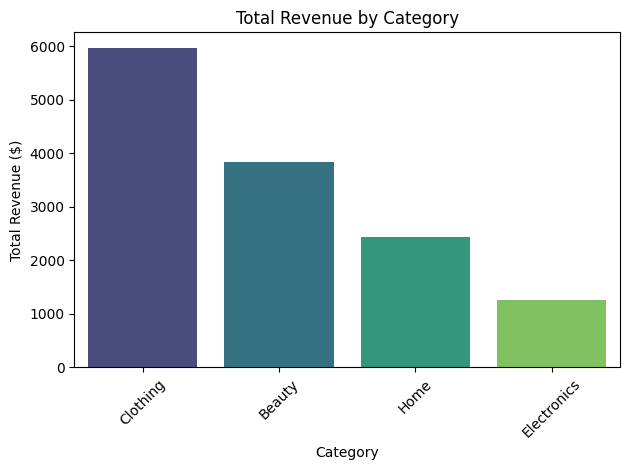

# E-Commerce Sales Performance Audit Project

Key visualizations were selected to highlight revenue trends, category performance, and distribution patterns for quick executive understanding.

This project includes:
- Data cleaning (missing values, type conversion)
- Feature engineering (Total_Cost)
- Z-score based product performance analysis
- Category-wise revenue summary
- Visualization of category revenue share

Tools: Python, Pandas, Matplotlib
